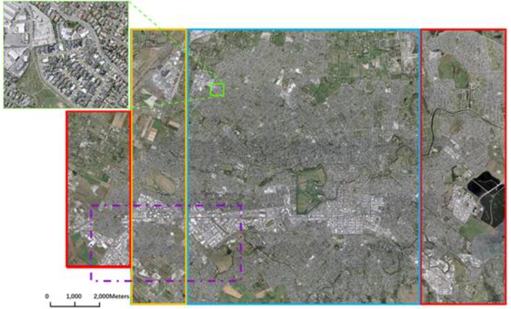
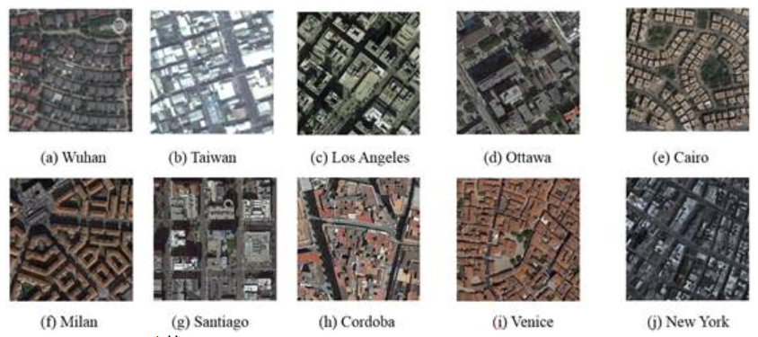
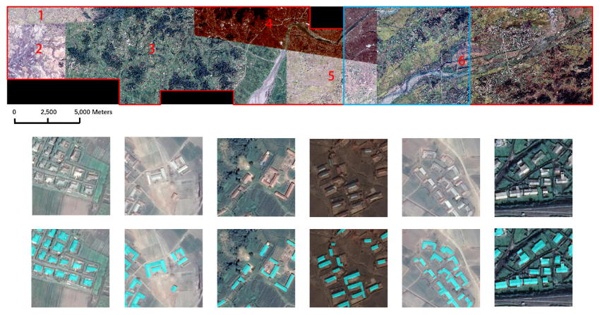
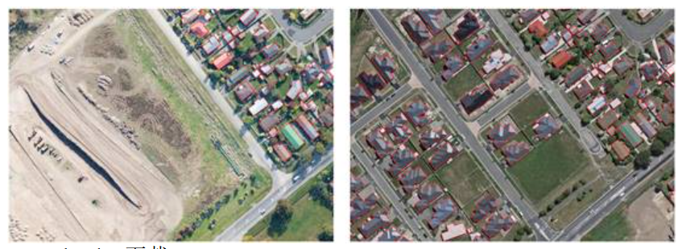
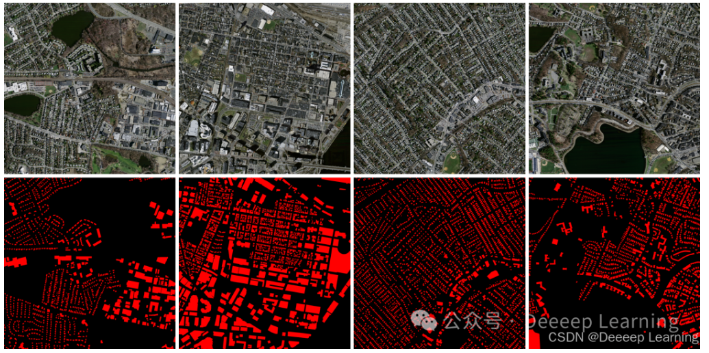
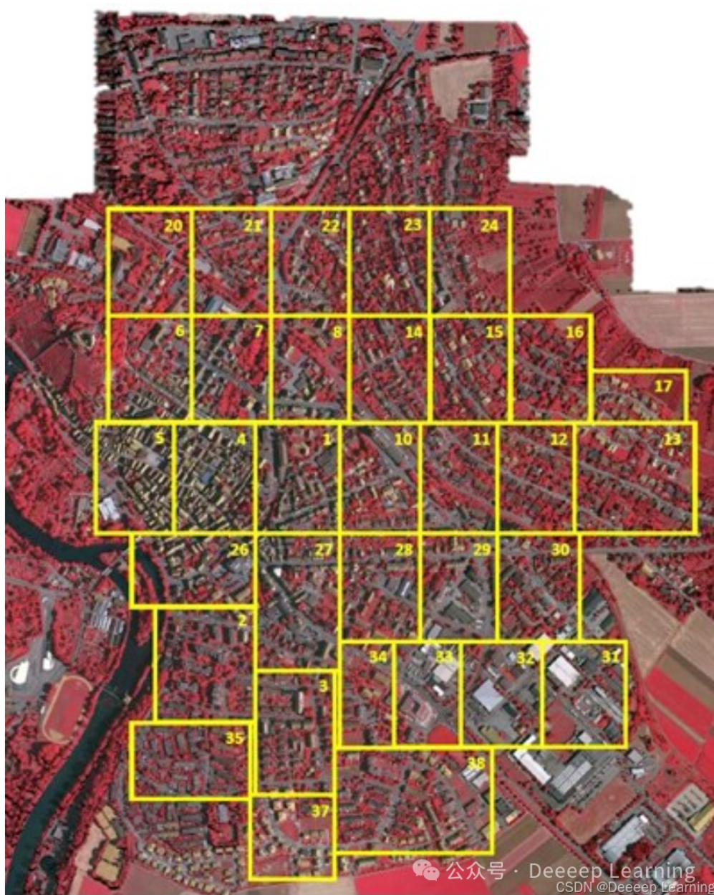
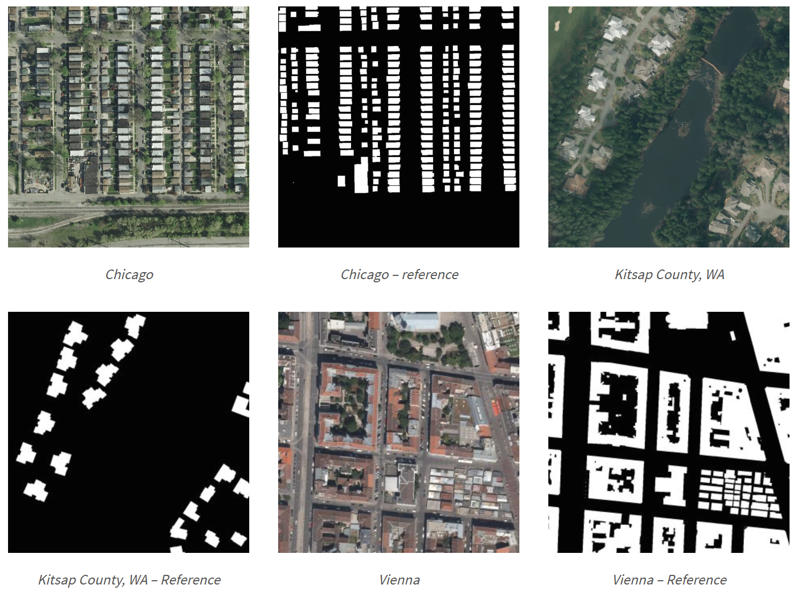
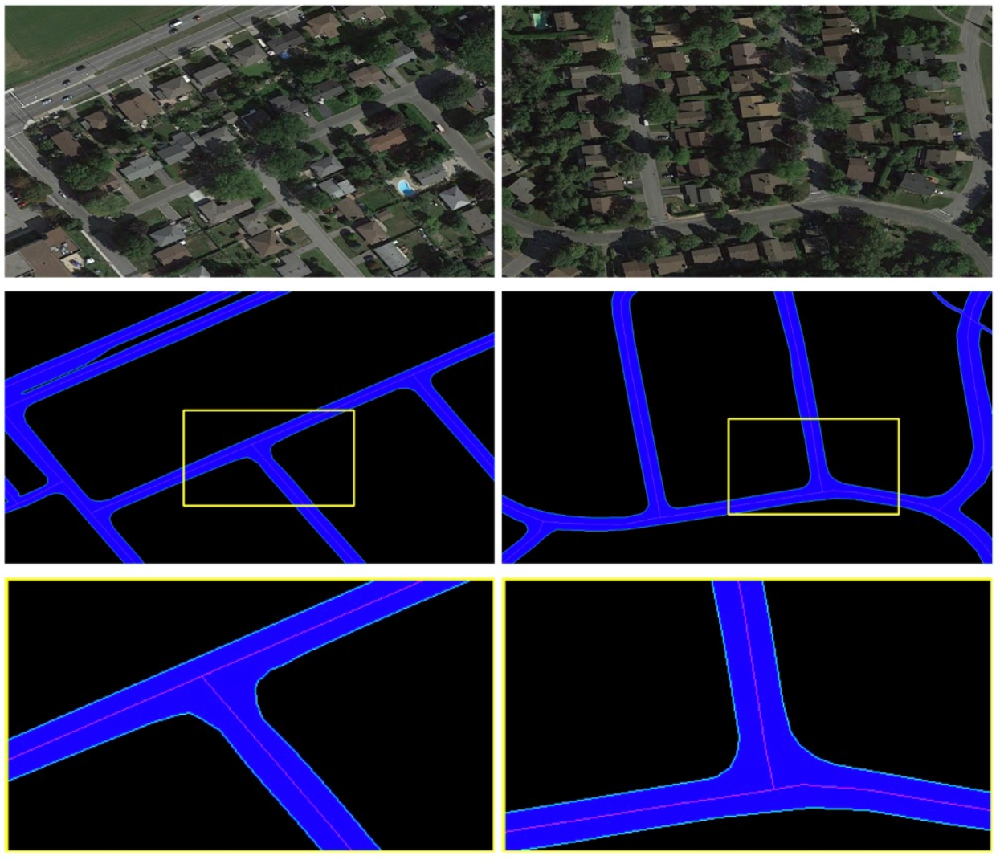
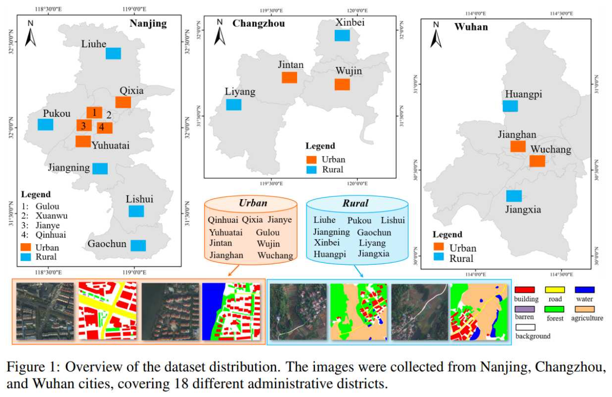
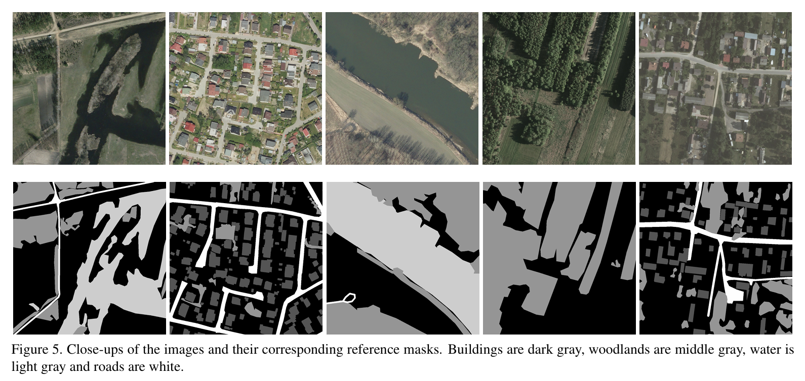

# Awesome Satellite Imagery Datasets 

⭐ 一个遥感相关的开源数据集，包含语义分割、目标提取、变化检测等 

⭐ 公众号：Deeeep Learning

# News

- 2025-03-11:  遥感影像语义分割数据集

## 1、 语义分割
## Build Dataset
- **WHU (build)**
 
    download: [**WHU**](http://gpcv.whu.edu.cn/data/building_dataset.html) 
      
  - **Aerial imagery dataset**
    
    航拍数据集包含从新西兰基督城 0.075 米空间分辨率和 450 平方公里覆盖范围内的航拍图像中提取的 220,000 多座独立建筑物。包含原始航空影像和裁切后的图像。

  - **Satellite dataset I (global cities)**
  
    从世界各地的城市和各种遥感资源收集的，包括 QuickBird、Worldview 系列、IKONOS、ZY-3 等。包含 204 张图像（512 × 512 块，分辨率从 0.3 米到 2.5 米不等）。除了卫星传感器的差异外，大气条件、全色和多光谱融合算法、大气和辐射校正以及季节的变化也使样本适合但具有挑战性，无法测试建筑物提取算法的稳健性。

  - **Satellite dataset Ⅱ (East Asia)**
  
    由 6 张邻近卫星图像组成，覆盖东亚 860 平方公里，地面分辨率为 0.45 米。
    该测试区域主要用于评估和开发深度学习方法对同一地理区域内不同数据源但具有相似建筑风格的建筑物的泛化能力。
    矢量建筑物地图也是在 ArcGIS 软件中完全手动描绘的，包含 34085 座建筑物。
    整幅图像被无缝裁剪成 17388 个 512×512 的图块，以方便训练和测试，处理方式与我们的航空数据集相同。其中 25749 座建筑物（13662 个图块）被分离出来用于训练，其余 8358 座建筑物（3726 个图块）用于测试。

   - **Building change detection dataset**
  由2012年4月获得的航拍图像组成，其中包含 20.5 平方公里内的 12796 栋建筑物（2016 年数据集中的同一区域有 16077 栋建筑物）

| WHU  |  Aerial imagery dataset   | Satellite dataset I (global cities) |  Satellite dataset Ⅱ (East Asia)  | Satellite dataset Ⅱ (East Asia) |   
|:----:|:-------------------------:|:-----------------------------------:|:---------------------------------:|:-------------------------------:|
| Task |    image segmentation     |         image segmentation          |        image segmentation         |        change detection         |    
| View |    |              |            |          |  

- **Massachusetts building dataset (build)**
  
    download: [**download(Kaggle)**](https://www.kaggle.com/datasets/balraj98/massachusetts-buildings-dataset) | [**download(阿里云)**](https://tianchi.aliyun.com/dataset/93425) 
    马萨诸塞州建筑数据集包含 151 张波士顿地区的航拍图像，每张图像的尺寸为 1500 × 1500 像素，面积为 2.25 平方公里。 
    因此，整个数据集覆盖大约 340 平方公里。数据分为 137 张图像的训练集、10 张图像的测试集和 4 张图像的验证集。

- **ISPRS Vaihingen (build)**
 
  download: [**download(飞浆AI)**](https://aistudio.baidu.com/datasetdetail/245379) 
      
  包含33幅不同大小的遥感图像和对应的DSM，分辨率为9厘米，类别：不透水面（rgb: 255, 255, 255）；建筑物（rgb: 0, 0, 255）；低矮植被（rgb: 0, 255, 255）；树木（rgb: 0, 255, 0）；汽车（rgb: 255, 255, 0）；背景（rgb: 255, 0, 0）

- **ISPRS Potsdam (build)**
 
  download: [**download(飞浆AI)**](https://aistudio.baidu.com/datasetdetail/145287) 
      
  包含 38 个大小相同的图像块，每个图像块均由从较大的顶部镶嵌图中提取的真正射影像构成。这些图像的空间分辨率为 5 厘米，尺寸为 6000×6000 像素

- **Inria Aerial Image Labeling Dataset (build)**

  [**介绍**](https://project.inria.fr/aerialimagelabeling/) |   [**download(飞浆AI)**](https://aistudio.baidu.com/datasetdetail/126725)

  覆盖810平方公里（训练405平方公里，测试405平方公里）,空间分辨率为0.3 m，图像尺寸1500*1500， 数据覆盖全球 10 个不同类型的城市，涵盖从人口密集区域（如旧金山金融区）到阿尔卑斯山镇（如奥地利蒂罗尔州的林茨）等多种城市聚落类型。

| dataset | Massachusetts building dataset |       ISPRS Vaihingen        |      ISPRS Potsdam      | Inria Aerial Image Labeling Dataset |
|:-------:|:------------------------------:|:----------------------------:|:-----------------------:|:-----------------------------------:| 
|  View   |         |       |  |              |            |  |  

## Road Dataset
- **RoadNet (Road)**

  加拿大渥太华几个典型的城区，图像的空间分辨率为每像素 0.21 米

  [**原文**](https://ieeexplore.ieee.org/document/8506600) | [**github**](https://github.com/yhlleo/RoadNet?tab=readme-ov-file) |  
  [**BaiduYun（Password: h2zt）**](https://pan.baidu.com/s/1l9RZvyYfLgTOx_k4LQRyhQ) | [**GoogleDrive**](https://drive.google.com/open?id=1GDHy7uwgOswuCDC49OamlNkAxjaITPBI)

##  Multi-class Dataset
- **LoveDA**

  [**原文**](https://arxiv.org/abs/2110.08733) | [**github**](https://github.com/Junjue-Wang/LoveDA?tab=readme-ov-file) |   [**download**](https://zenodo.org/records/5706578)

  LoveDA 数据集包含来自三个不同城市(南京、常州、武汉)，城市、农村地区的5987张0.3m高分辨率影像(1024*1024)和166,768个标注语义对象。

  类别：Building, Road, Water, Barren, Forest, Agricultural, Background
  
- **landcover.ai**

  [**原文**](https://arxiv.org/pdf/2005.02264) | [**github**](https://github.com/MortenTabaka/Semantic-segmentation-of-LandCover.ai-dataset) |   [**download(Kaggle)**](https://www.kaggle.com/datasets/adrianboguszewski/landcoverai)

  波兰、中欧的航空影像土地覆盖数据，分辨率为25厘米（33 张正射影像，~9000x9500 像素）和50厘米（8 张正射影像，~4200x4700 像素）

  类别：Build(1), Wood(2), Water(3), Road(4)

| dataset |           RoadNet         |           LoveDA          |         landcover.ai      |
|:-------:|:-------------------------:|:-------------------------:|:-------------------------:|
|  View   |  |  |  |

